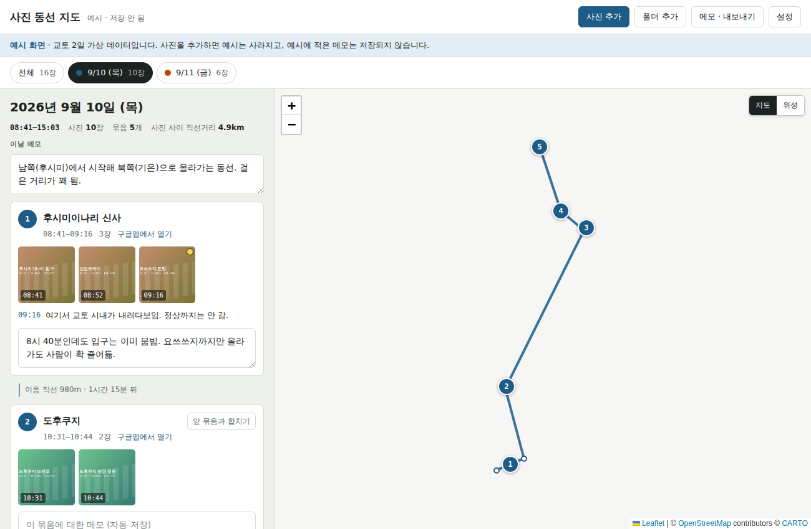

# 사진 동선 지도 (photo-route-map)

여행 사진의 **촬영 시각과 GPS(EXIF)** 를 읽어 날짜별 이동 동선을 지도에 그리고, 사진·묶음·하루 단위로 메모를 남기는 단일 HTML 도구입니다.
서버가 없습니다. 사진은 브라우저 안에서만 처리되고 외부로 전송되지 않습니다.



## 기능

- **날짜별 분리**: 촬영 시각으로 날짜 탭을 만듭니다. "하루 시작 시각"(기본 04시) 이전 사진은 전날로 칩니다.
- **자동 묶음**: 같은 날 연달아 찍은 사진을 한 묶음(장소)으로 묶습니다.
  - 직전 사진과의 거리가 기준(기본 250m)을 넘거나 시간 간격이 기준(기본 30분)을 넘으면 새 묶음이 됩니다.
  - 자동 결과가 틀리면 손으로 나누거나 합칠 수 있습니다.
- **여행지 그룹**: 여러 도시를 다닌 여행이면 로마·나폴리·피렌체처럼 그룹을 직접 만들어 나눠 봅니다.
  - 상단 "+ 그룹 만들기"로 이름을 넣어 만들고, 그 그룹 탭을 고른 채 "사진 추가"·"폴더 추가"·드래그로 넣은 사진이 그 그룹에 들어갑니다.
  - 이미 넣은 사진 옮기기: 하루 보기 위쪽의 "이날 사진 N장을 [그룹]으로 옮기기", 묶음 카드의 그룹 선택, 크게 보기의 "여행지 그룹" 선택(사진 한 장), 또는 그룹 탭에서 같은 사진을 다시 추가. 그룹에 넣지 않은 사진은 "미분류"로 보입니다.
  - 그룹을 고르면 지도·날짜 탭이 그 그룹 사진만으로 좁혀집니다. 도시를 옮긴 날은 각 그룹에서 그 부분만 보이고, "이날 다른 그룹" 버튼으로 넘어갑니다.
  - 그룹을 지워도 사진과 메모는 남고 미분류로 돌아갑니다.
- **메모**: 사진 1장, 묶음(장소 이름 + 메모), 하루 단위로 남길 수 있습니다.
- **지도**
  - 사진 위치를 촬영 순서대로 선으로 잇고, 묶음마다 번호 마커를 표시합니다.
  - 묶음에 장소 이름(예: 콜로세움)을 적으면 마커 옆에 그 이름이 바로 뜹니다. 여러 날을 한꺼번에 보는 화면에도 이름 붙인 장소가 표시됩니다.
  - 지도와 위성 배경을 전환할 수 있습니다.
  - 묶음마다 "구글맵에서 열기" 링크가 붙습니다.
- **크게 보기**: 좌우 화살표나 스와이프로 넘기고, Esc로 닫습니다. 이 화면에서 사진 메모를 입력하고 묶음을 나누거나 합칩니다.
- **저장**
  - 메모는 브라우저 `localStorage`에 자동 저장됩니다.
  - `.json` 메모 파일로 내보내거나 불러올 수 있습니다.
- **다른 기기와 연동 (선택)**
  - 구글 계정에 로그인하면 사진 원본·썸네일·메모를 **본인 구글드라이브**에 저장해, 다른 PC나 모바일에서 사진을 다시 추가하지 않고 이어서 봅니다.
  - 사진은 제3자 서버를 거치지 않고 본인 드라이브에만 올라갑니다. 별도 설정이 필요하고 https로 호스팅했을 때만 동작합니다([연동 설정](#연동-설정-구글드라이브) 참고).
- **JPEG 일괄 변환**
  - 날짜별 ZIP으로 저장합니다.
  - HEIC·PNG 등은 JPEG로 변환하면서 촬영 시각과 GPS를 다시 기록합니다. 원래 JPEG는 원본 그대로 넣습니다.
  - 파일명은 `YYYY-MM-DD_HHMMSS_원래이름.jpg` 형식이라 이름순 정렬이 곧 시간순입니다.

## 빠른 시작 (사용자)

1. `dist/사진동선지도.html`을 받아 Chrome이나 Safari로 엽니다(더블클릭).
2. "사진 추가", "폴더 추가", 또는 드래그로 사진을 넣습니다.
3. 날짜 탭을 골라 동선을 보고 메모를 적습니다.
4. 작업을 마치면 "메모 · 내보내기 → 메모 파일로 저장"으로 백업합니다.

지도 배경을 받아오려면 인터넷 연결이 필요합니다. 나머지 기능은 모두 파일 안에 포함되어 있습니다.

### 사진 준비

- **EXIF가 남아 있는 원본**이어야 합니다. 메신저나 SNS를 거친 사진은 대부분 촬영 시각과 GPS가 지워져 있습니다.
- 휴대폰에서 PC로 옮길 때는 케이블, 클라우드 원본 다운로드, AirDrop 등을 씁니다. AirDrop은 공유 옵션에서 위치 포함을 켜야 GPS가 유지됩니다.
- 촬영 당시 카메라 위치 서비스가 꺼져 있었다면 GPS는 복원할 수 없습니다.
  - GPS가 없는 사진은 목록에는 나오지만 지도에는 표시되지 않습니다.
  - 촬영 시각이 없는 사진은 파일 수정 시각을 대신 쓰고, 화면에 "(추정)"으로 표시합니다.

### 다시 열 때

- 브라우저 보안상 이전에 연 로컬 사진을 자동으로 다시 읽을 수 없습니다. 파일을 다시 열면 **같은 사진을 다시 추가**해야 합니다.
- 메모는 `파일명|촬영시각` 키로 연결되어 있어서, 같은 사진을 넣으면 자동으로 다시 붙습니다. **사진 파일명을 바꾸면 연결이 끊깁니다.**
- 다른 브라우저나 PC에서 쓸 때는 사진을 추가한 뒤 "메모 파일 불러오기"로 `.json`을 넣습니다.
- **연동을 켜 두면** 위 과정 없이 같은 계정으로 로그인만 하면 사진·메모가 그대로 복원됩니다([연동 설정](#연동-설정-구글드라이브)).

## 저장 형식

`localStorage["photo-route-map.v1"]`와 내보낸 `.json` 파일은 같은 구조입니다.

```jsonc
{
  "v": 1,
  "photoNotes": { "IMG_1234.HEIC|20260912092500": "사진 메모" },
  "groupNotes": { "<묶음 첫 사진 키>": { "title": "장소 이름", "text": "묶음 메모" } },
  "dayNotes":   { "2026-09-12": "하루 메모" },
  "breaks":     { "<사진 키>": true },   // true = 여기서 강제로 나눔, false = 앞 묶음에 강제로 붙임
  "trips":      { "<그룹 id>": { "name": "로마", "created": 1790000000000 } },  // 여행지 그룹 (created 순서로 탭 표시)
  "photoTrip":  { "<사진 키>": "<그룹 id>" },  // 없으면 미분류
  "settings":   { "dayStartHour": 4, "gapMin": 30, "distM": 250 },
  "savedAt": "ISO-8601",
  // 내보낸 파일에만 있음 (참고용, 불러올 때는 무시)
  "exportedAt": "ISO-8601",
  "photos": [{ "key": "...", "name": "...", "time": "ISO-8601", "lat": 0, "lng": 0 }]
}
```

- **사진 키**: `원본파일명|YYYYMMDDHHMMSS`. 촬영 시각은 EXIF의 `DateTimeOriginal`을 쓰고, 없으면 `CreateDate`, `DateTime`, 파일 수정 시각 순서로 대신합니다.
- **묶음 키**: 그 묶음의 첫 사진 키입니다.
  - 묶음을 합치면 뒤 묶음의 메모가 앞 묶음 메모 뒤에 이어 붙습니다.
  - 묶음을 나누면 새 묶음은 빈 메모로 시작합니다.
- **여행지 그룹**: 사진 키 단위로 저장하므로 사진 파일명을 바꾸면 그룹 연결도 끊깁니다. 다른 그룹의 사진끼리는 같은 묶음이 되지 않습니다.
- **메모 불러오기**: 현재 메모에 합칩니다. 같은 키가 있으면 파일 쪽 값이 이깁니다.
- **연동 파일(`project.json`)**: 드라이브에 저장되는 파일도 위와 같은 구조에, 사진마다 `originalFileId`·`thumbFileId`(드라이브 파일 id)와 `rev`(버전 번호)가 더 붙습니다. 여러 기기가 같이 쓸 때는 `rev`가 큰 쪽을 기준으로 메모를 합치는 **마지막 저장 우선(last-write-wins)** 방식입니다.

## 동작 방식과 제약

- **시간대**
  - EXIF 촬영 시각은 보통 카메라(휴대폰)가 있던 곳의 현지 시각이고, 시간대 정보가 없습니다.
  - 이 도구는 그 값을 현지 시각 그대로 날짜 구분에 씁니다. `OffsetTimeOriginal`은 사용하지 않습니다.
- **거리 표시**: "사진 사이 직선거리", "이동 직선 …m"는 사진 위치를 이은 **직선 거리**입니다. 실제로 걸은 경로가 아닙니다.
- **HEIC**
  - Safari는 HEIC를 직접 표시하지만, Chrome·Firefox 등은 [heic2any](https://github.com/alexcorvi/heic2any)로 JPEG 변환 후 표시합니다. 장수가 많으면 미리보기 생성이 느립니다.
  - 일부 HEIC(libheif로 만든 파일 등)는 exifr가 컨테이너에서 EXIF를 찾지 못합니다. 이 경우 파일 안의 `Exif\0\0` + TIFF 블록을 직접 찾아 다시 읽는 대비 경로가 있습니다.
  - **실제 아이폰 HEIC로는 아직 테스트하지 않았습니다.**
- **메모리**
  - 썸네일(짧은 변 360px)만 계속 보관합니다. 크게 보기용 변환본은 최근 8장만 캐시합니다.
  - ZIP은 날짜 단위로 만들어 한 번에 메모리에 올리는 양을 줄였습니다.
- **여러 파일 다운로드**: "전체 사진 JPEG로 저장"은 날짜 수만큼 ZIP을 연속으로 받습니다. Chrome에서 "여러 파일 다운로드 허용"을 물으면 허용해야 합니다.
- **자동 저장 한계**: `localStorage`는 브라우저·기기별로 따로 저장됩니다. 방문 기록 삭제나 시크릿 창에서는 사라질 수 있으니 메모 파일로 백업하세요.
- **claude.ai 아티팩트로 배포하지 않은 이유**: 아티팩트 페이지는 허용된 CDN 외의 이미지 로드와 파일 다운로드를 막습니다. 그래서 지도 타일과 ZIP·메모 저장이 동작하지 않아 로컬 파일로 만들었습니다.

## 외부 서비스

페이지가 실행 중에 접속하는 곳은 아래와 같습니다. 사진 파일이나 메모는 전송하지 않습니다.

| 용도 | 호스트 | 비고 |
|---|---|---|
| 지도 배경 (기본) | `server.arcgisonline.com` (Esri World Street Map) | API 키·Referer 불필요. 화면에 저작권 표기 |
| 위성 배경 | `server.arcgisonline.com` (Esri World Imagery) | 화면에 저작권 표기 |
| 글꼴 | `fonts.googleapis.com`, `fonts.gstatic.com` | 실패하면 시스템 글꼴로 대체 |
| 구글맵 링크 | `www.google.com/maps` | 링크를 누를 때만 해당 좌표가 전달됨 |
| 연동 로그인 | `accounts.google.com` | **연동을 켰을 때만.** 구글 OAuth 로그인 |
| 연동 저장소 | `www.googleapis.com` | **연동을 켰을 때만.** 사진 원본·썸네일·메모가 **본인 구글드라이브**로 전송됨 |

- 타일 요청에는 보고 있는 지도 영역이 드러납니다.
- 개인 용도 외에 공개 배포하거나 상업적으로 쓸 때는 각 타일 제공자의 이용 약관을 확인하세요.
- `tile.openstreetmap.org`는 쓰지 않습니다. OSM 타일 정책은 웹 페이지에 유효한 `Referer`를 요구하는데, `file://`로 연 페이지는 Referer를 보내지 않습니다.
- 기본 배경으로 쓰던 CARTO Voyager(`*.basemaps.cartocdn.com`)는 API 키를 요구하도록 정책이 바뀌어(키 없이 열면 "API KEY REQUIRED" 워터마크가 찍힘) 키·Referer가 필요 없는 Esri World Street Map으로 교체했습니다.
- **연동을 켜면** 사진 원본·썸네일·메모가 본인 구글드라이브로 올라갑니다. 즉, 연동을 쓰는 동안에는 "사진이 기기 밖으로 나가지 않는다"가 더 이상 성립하지 않습니다(제3자 서버는 안 거치고 본인 드라이브에만 저장). 연동을 끄면 기존처럼 로컬에서만 처리됩니다.

## 연동 설정 (구글드라이브)

다른 기기·모바일에서 사진을 이어 보려면 아래 설정이 필요합니다. 브라우저 보안상 **`file://`로 연 페이지에서는 구글 로그인이 막히므로**, 앱을 https로 호스팅해야 합니다(개인용은 GitHub Pages 무료).

1. **앱 호스팅 (GitHub Pages)**: `python3 scripts/build.py`로 빌드하면 `docs/index.html`이 함께 나옵니다. 이 파일을 커밋·push한 뒤, 저장소 **Settings → Pages → Build and deployment**에서 **Source: Deploy from a branch**, **Branch: `main` / 폴더 `/docs`** 로 지정하고 Save 합니다. 잠시 뒤 `https://<사용자>.github.io/<저장소>/` 로 열립니다. (예: `https://gyujun9403.github.io/trvmap/`)
2. **구글 클라우드 콘솔** (무료):
   - 프로젝트 생성.
   - **API 및 서비스 → 라이브러리 → "Google Drive API" 사용 설정(Enable)**. (이걸 빠뜨리면 로그인은 돼도 Drive 호출이 모두 403으로 막힙니다.)
   - **OAuth 동의 화면**을 "외부 / 테스트" 로 만들고, 본인 구글 계정을 **테스트 사용자**로 추가합니다.
   - 범위(scope)에 `.../auth/drive.file`을 추가합니다(민감 범위 아님, 구글 심사 불필요).
   - **사용자 인증 정보 → OAuth 2.0 클라이언트 ID → 웹 애플리케이션**을 만들고, **승인된 자바스크립트 원본(Authorized JavaScript origins)**에 아래 "출처"를 추가합니다. 이때 **경로(path) 없이 `scheme://host[:port]` 형식**만 넣습니다.
     - 배포용: `https://<사용자>.github.io` — 저장소가 프로젝트 페이지(`https://<사용자>.github.io/<저장소>/`)여도 출처는 **경로 없이 호스트까지만** 넣습니다.
     - 로컬 테스트용: `http://localhost:8000` (`python3 -m http.server`의 기본 포트).
     - 참고: 자바스크립트 원본에는 "승인된 리디렉션 URI"를 따로 넣을 필요가 없습니다(토큰 모델 사용).
   - 발급된 **클라이언트 ID**를 복사합니다.
3. **클라이언트 ID 넣기**: `src/index.html`의 `const GOOGLE_CLIENT_ID = "";` 에 붙여넣고 다시 빌드합니다. (거의 바뀌지 않는 값이라 소스 상수로 둡니다. 비워 두면 연동 메뉴가 숨겨지고 앱은 로컬 전용으로 동작합니다.)
4. **사용**: 호스팅한 주소를 열고 헤더의 **연동 → 구글 계정으로 로그인**. 테스트 모드에선 로그인 시 "확인되지 않은 앱" 경고가 한 번 뜨는데 본인 계정이면 그대로 진행하면 됩니다.
   - 로그인하면 내 드라이브에 `사진동선지도/` 폴더가 생기고 원본 사진, `thumbs/`(썸네일), `project.json`(메모·인덱스)이 저장됩니다.
   - 다른 기기에서 같은 계정으로 로그인하면 사진을 다시 추가하지 않아도 동선·썸네일이 뜨고, 크게 보기·JPEG 저장은 그때 원본을 내려받습니다.
   - 무료 용량(구글 15GB)을 넘으면 업로드가 실패합니다.

### 연동 문제 해결

- **로그인 버튼이 안 보임**: `GOOGLE_CLIENT_ID`가 비어 있거나(→ 넣고 재빌드), `file://`로 열었거나(→ https로 접속), 로그인 스크립트 로드 실패(→ 인터넷 확인).
- **로그인은 되는데 동기화가 403**: 콘솔에서 **Google Drive API 사용 설정**을 안 했을 때. 위 2단계 확인.
- **로그인 창에서 `redirect_uri_mismatch`/`origin` 오류**: 지금 접속한 주소의 **출처(scheme+host+port)**가 "승인된 자바스크립트 원본"에 정확히 들어가 있는지 확인(경로 제외, http/https·포트까지 일치).
- **`access_denied` 또는 로그인 직후 튕김**: OAuth 동의 화면이 "테스트" 상태인데 로그인 계정이 **테스트 사용자**에 없을 때.
- **반영이 안 됨**: 다른 기기 변경은 자동 폴링이 아니라, 헤더 **연동 → 지금 동기화**를 눌러 최신 상태를 받아옵니다.

## 개발

```
photo-route-map/
├── src/index.html          # 앱 원본 (HTML + CSS + JS). 라이브러리 자리 표시자 포함
├── vendor/                 # 인라인할 라이브러리 (버전 고정, SHA256SUMS)
│   └── licenses/           # 각 라이브러리 라이선스 원문
├── scripts/
│   ├── build.py            # src + vendor → dist 단일 HTML
│   └── fetch_vendor.sh     # vendor/ 를 npm에서 다시 받기 (버전 올릴 때만)
├── dist/사진동선지도.html   # 빌드 결과물 (로컬 더블클릭용, 커밋함)
├── tests/
│   ├── make_test_images.py # 테스트용 JPEG/PNG/HEIC 생성 → tests/fixtures/
│   └── e2e_test.py         # Playwright(Chromium) E2E 테스트
├── docs/                   # 스크린샷 + index.html (GitHub Pages /docs 배포용, 커밋함)
├── requirements-dev.txt
└── THIRD_PARTY_NOTICES.md
```

### 빌드

```sh
python3 scripts/build.py      # → dist/사진동선지도.html, docs/index.html
```

- 표준 라이브러리만 씁니다.
- `src/index.html`의 `/*__LEAFLET_CSS__*/`와 `<!--__VENDOR__-->` 자리에 `vendor/` 파일을 인라인합니다.
- 라이브러리 로드 순서: Leaflet → exifr → piexifjs → JSZip → heic2any.
- 같은 결과물을 `dist/사진동선지도.html`(로컬 더블클릭용)과 `docs/index.html`(GitHub Pages `/docs` 배포용) 두 곳에 냅니다.
- 구글 로그인(GIS)만은 인라인하지 않고 `<head>`에서 원격으로 불러옵니다(OAuth 특성상 구글 도메인에서 받아야 함). 없거나 오프라인이면 연동만 비활성화되고 나머지는 정상 동작합니다.
- 연동을 쓰려면 `src/index.html`의 `GOOGLE_CLIENT_ID` 상수를 채워야 합니다([연동 설정](#연동-설정-구글드라이브)).
- `src/index.html`은 라이브러리 없이 단독으로 열면 "도구를 불러오지 못했습니다"가 뜹니다. 확인은 항상 `dist/` 결과물로 하세요.

### 테스트

```sh
pip install -r requirements-dev.txt
python3 -m playwright install chromium   # 처음 한 번
python3 scripts/build.py
python3 tests/make_test_images.py
python3 tests/e2e_test.py
```

- E2E 테스트는 지도 타일과 글꼴 요청을 막고 실행하므로 네트워크 없이 돕니다.
- 스크린샷과 ZIP 결과는 `tests/out/`에 저장됩니다.
- 확인 항목:
  - 예시 화면, 폰 폭(400px) 가로 스크롤 없음
  - 새벽 사진의 날짜 귀속, 묶음 나누기, 메모 자동 저장
  - 여행지 그룹 만들기·그룹 탭에서 사진 추가·다시 추가로 옮기기·묶음 카드/하루 통째/크게 보기에서 옮기기·이름 바꾸기·삭제, 새로고침 후 복원
  - 장소 이름 → 지도 마커 옆 라벨
  - 날짜 ZIP 파일명과 개수, 메모 파일 내보내기, 새로고침 후 같은 사진 재추가 시 메모 복원
  - HEIC 촬영 시각·GPS 판독, 썸네일, 크게 보기, HEIC → JPEG 변환본의 촬영 시각·GPS 유지

### 라이브러리 버전 올리기

`scripts/fetch_vendor.sh`의 버전 변수를 고친 뒤 실행합니다. 그다음 `scripts/build.py`의 `LIBS` 주석과 `THIRD_PARTY_NOTICES.md`도 함께 수정하세요.

## 라이선스

- 이 저장소 자체의 라이선스는 아직 정하지 않았습니다. 공개할 경우 `LICENSE`를 추가하세요.
- 포함된 서드파티 라이브러리의 라이선스는 [THIRD_PARTY_NOTICES.md](THIRD_PARTY_NOTICES.md)에 정리했습니다. heic2any 번들에 포함된 libheif는 LGPL-3.0이므로 공개 배포 전에 확인하세요.
